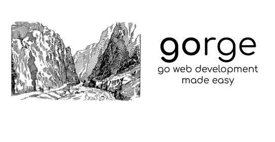

# gorge

gorge is a web development DSL for go. It is simple and easy-to-use. It is currently in beta, and is going to have new features soon, such as authentication. You can find out ways to contribute at the end of this README.

## Installation

Use the `go get` CLI command to install gorge.

```bash
go get -u github.com/cococats/gorge
```

## Usage

### Connections

All functions will post to `localhost:6789` unless otherwise specified through `end`

### Functions

`say`: Use say to print text. The URL will parse to: `localhost:6789`.

`get`: Use get to get a HTTP request. The URL will parse to: `localhost:6789/get`.

`put`: Use put to put a HTTP request. The URL will parse to: `localhost:6789/put`.

`post`: Use post to post a HTTP Request.

`method`: Use method to get and post a HTTP method such as `patch`.

`end`: Use end to start a connection to `localhost:6789`. This is required for your application to work!

#### Decoding from Template Files

`decodexml`: Decodexml decodes an XML (.xmL) file.

`decodejson`: Decodejson decodes a JSON (.json) file.

`decodepem`: Decodepem decodes an PEM (.pem) file.
 

### Example

Example using `get` and `say`:

```go

package main

import (
"github.com/cococats/gorge"
)

func main() {
   get("http://localhost:6789")
   say("hello world")
   end()
}

```

#### A More Advanced Example

```go
import "GitHub.com/cococats/gorge"

func main() {

say("Hello World")
get("github.com/cococats/gorge")
post("localhost:6789", "img/jpg", nil)
end()
```

## Contributing
Pull requests are welcome. For major changes not specified below, please open an issue first to discuss what you would like to change. Currently, these are the next steps for gorge:

- JSON, PEM, and XML support.
- HTTP Authorization.
- Adding parameters.

Please feel free to add those features in a seperate doc. 

Please make sure to update tests as appropriate.

## License
[Apache 2.0](https://choosealicense.com/licenses/apache-2.0/)
